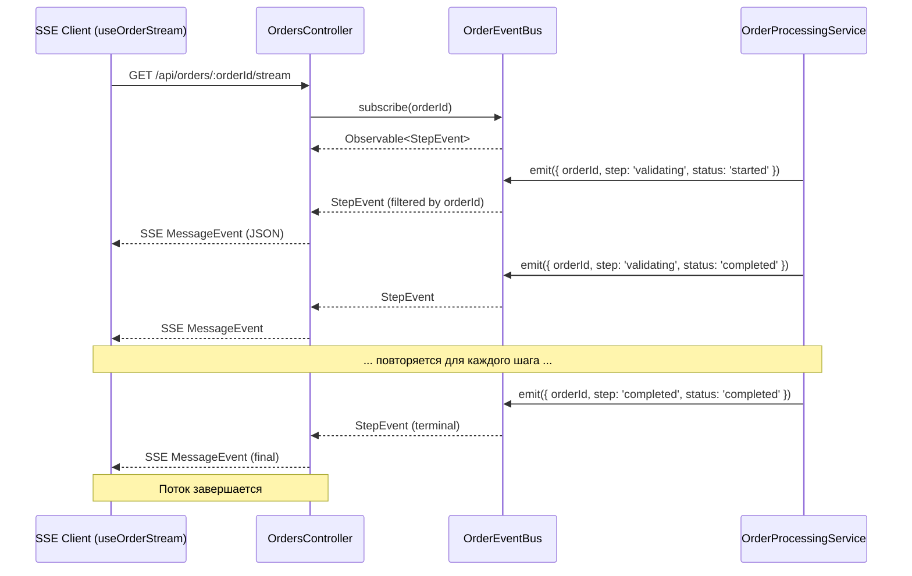

# Документ проектирования: Order Progress SSE

## Обзор

Замена текущей polling-based SSE реализации (опрос БД каждые 3 секунды) на event-driven архитектуру с мгновенной доставкой структурированных событий прогресса заказа. Используется rxjs `Subject` как внутрипроцессная шина событий — новые зависимости не требуются.

**Ключевое изменение**: вместо `defer().pipe(repeat({ delay: 3000 }))` контроллер подписывается на `OrderEventBus.subscribe(orderId)`, который возвращает отфильтрованный `Observable<StepEvent>`. Pipeline эмитит события синхронно между шагами — клиент получает обновления мгновенно.

## Архитектура



### Принцип работы

1. **OrderEventBus** — singleton-сервис с `Subject<StepEvent>`. Метод `subscribe(orderId)` возвращает `this.subject.pipe(filter(e => e.orderId === orderId))`.
2. **OrderProcessingService** — инжектит `OrderEventBus`, вызывает `emit()` перед и после каждого шага. Существующая логика не меняется.
3. **OrdersController** — `@Sse(':orderId/stream')` подписывается на `eventBus.subscribe(orderId)`, маппит в `MessageEvent`, завершает поток при terminal status.
4. **useOrderStream** — парсит новый формат `StepEvent`, сохраняет обратную совместимость через маппинг полей.

## Компоненты и интерфейсы

### StepEvent (интерфейс)

```typescript
// backend/src/queue/interfaces/step-event.interface.ts

export type OrderStep =
  | 'validating'
  | 'auth'
  | 'account_selection'
  | 'balance_check'
  | 'proxy_setup'
  | 'browser_launch'
  | 'epic_login'
  | 'region_change'
  | 'purchasing'
  | 'completed'
  | 'failed';

export type StepStatus = 'started' | 'completed' | 'failed';

export interface StepEvent {
  orderId: string;
  step: OrderStep;
  status: StepStatus;
  message: string;
  timestamp: string; // ISO 8601
  progress: number;  // 0-100
}
```

### OrderEventBus (сервис)

```typescript
// backend/src/queue/order-event-bus.service.ts

import { Injectable } from '@nestjs/common';
import { Subject, Observable, filter } from 'rxjs';
import { StepEvent } from './interfaces/step-event.interface';

@Injectable()
export class OrderEventBus {
  private readonly subject = new Subject<StepEvent>();

  emit(event: StepEvent): void {
    this.subject.next(event);
  }

  subscribe(orderId: string): Observable<StepEvent> {
    return this.subject.asObservable().pipe(
      filter((event) => event.orderId === orderId),
    );
  }
}
```

### Маппинг шагов к прогрессу

```typescript
// backend/src/queue/constants/step-progress.ts

export const STEP_PROGRESS_MAP: Record<string, number> = {
  validating: 5,
  auth: 15,
  account_selection: 25,
  balance_check: 35,
  proxy_setup: 40,
  browser_launch: 50,
  epic_login: 60,
  region_change: 70,
  purchasing: 85,
  completed: 100,
  failed: 100,
};

export const STEP_MESSAGES_RU: Record<string, string> = {
  validating: 'Проверка данных заказа...',
  auth: 'Авторизация в Epic Games...',
  account_selection: 'Выбор аккаунта для покупки...',
  balance_check: 'Проверка баланса...',
  proxy_setup: 'Настройка соединения...',
  browser_launch: 'Запуск браузера...',
  epic_login: 'Вход в Epic Games...',
  region_change: 'Смена региона...',
  purchasing: 'Покупка V-Bucks...',
  completed: 'Заказ выполнен!',
  failed: 'Ошибка обработки заказа',
};
```

### Изменения в OrderProcessingService

Добавляется инъекция `OrderEventBus` и вспомогательный метод `emitStep()`:

```typescript
// Добавить в конструктор:
private readonly orderEventBus: OrderEventBus

// Вспомогательный метод:
private emitStep(orderId: string, step: OrderStep, status: StepStatus, message?: string): void {
  this.orderEventBus.emit({
    orderId,
    step,
    status,
    message: message ?? STEP_MESSAGES_RU[step] ?? step,
    timestamp: new Date().toISOString(),
    progress: STEP_PROGRESS_MAP[step] ?? 0,
  });
}
```

Вызовы `emitStep()` добавляются между существующими шагами без изменения логики:

```typescript
// Перед шагом:
this.emitStep(orderId, 'auth', 'started');
const exchangeCode = await this.authService.getExchangeCode(...);
this.emitStep(orderId, 'auth', 'completed');
```

### Изменения в OrdersController

```typescript
@Sse(':orderId/stream')
streamOrderStatus(@Param('orderId') orderId: string): Observable<MessageEvent> {
  return this.orderEventBus.subscribe(orderId).pipe(
    map((event: StepEvent) => ({
      data: JSON.stringify(event),
    } as MessageEvent)),
    takeWhile((_, index) => {
      // Завершаем после terminal event (логика внутри finalize)
      return true;
    }),
    // Завершаем поток при terminal status
    takeWhile((msg) => {
      const data = JSON.parse((msg as any).data);
      return !['completed', 'failed'].includes(data.step) || data.status !== 'completed';
    }, true), // inclusive: true — отправляем финальное событие перед закрытием
  );
}
```

### Изменения в useOrderStream (фронтенд)

```typescript
// frontend/src/lib/useOrderStream.ts

export interface OrderStepEvent {
  orderId: string;
  step: string;
  status: 'started' | 'completed' | 'failed';
  message: string;
  timestamp: string;
  progress: number;
}

// Обратная совместимость: маппим StepEvent → OrderStreamEvent
function mapToLegacy(event: OrderStepEvent): OrderStreamEvent {
  return {
    orderId: event.orderId,
    status: event.step === 'completed' ? 'completed' 
           : event.step === 'failed' ? 'failed' 
           : 'processing',
    timelineLogs: [{
      tag: `[${event.step}]`,
      message: event.message,
      timestamp: event.timestamp,
      level: event.status === 'failed' ? 'error' : 'info',
    }],
  };
}
```

Хук возвращает дополнительные поля:

```typescript
export function useOrderStream(orderId: string | null | undefined): {
  state: OrderStreamState;
  lastEvent: OrderStreamEvent | null;
  // Новые поля:
  currentStep: string | null;
  progress: number;
  stepHistory: OrderStepEvent[];
}
```

### Регистрация в QueueModule

```typescript
// queue.module.ts — добавить в providers и exports:
providers: [OrderProcessor, OrderProcessingService, QueueService, OrderEventBus],
exports: [BullModule, QueueService, OrderEventBus],
```

`OrdersModule` импортирует `QueueModule` для доступа к `OrderEventBus` в контроллере.

## Модели данных

### StepEvent (передаётся по SSE)

| Поле | Тип | Описание |
|------|-----|----------|
| orderId | string | UUID заказа |
| step | OrderStep | Текущий шаг (enum из 11 значений) |
| status | StepStatus | 'started' / 'completed' / 'failed' |
| message | string | Человекочитаемое описание на русском |
| timestamp | string | ISO 8601 (e.g. `2024-01-15T12:30:00.000Z`) |
| progress | number | 0-100, общий прогресс заказа |

### Маппинг step → progress

| Step | Progress % |
|------|-----------|
| validating | 5 |
| auth | 15 |
| account_selection | 25 |
| balance_check | 35 |
| proxy_setup | 40 |
| browser_launch | 50 |
| epic_login | 60 |
| region_change | 70 |
| purchasing | 85 |
| completed / failed | 100 |


## Свойства корректности

*Свойство (property) — это характеристика или поведение, которое должно выполняться для всех допустимых входных данных системы. Свойства служат мостом между человекочитаемыми спецификациями и машинно-верифицируемыми гарантиями корректности.*

### Property 1: Фильтрация событий по orderId

*Для любых* двух различных orderId (A и B), если подписчик подписан на orderId A, то при эмиссии события с orderId B подписчик НЕ должен получить это событие, а при эмиссии события с orderId A — должен получить ровно это событие.

**Validates: Requirements 1.3, 3.5**

### Property 2: Безопасность эмиссии без подписчиков

*Для любого* валидного StepEvent, вызов `emit()` при отсутствии активных подписчиков не должен вызывать исключений и не должен приводить к накоплению данных в памяти.

**Validates: Requirements 1.4, 5.3**

### Property 3: Множественные подписчики получают по одной копии

*Для любого* orderId и любого количества подписчиков (N ≥ 1) на этот orderId, при эмиссии одного события каждый подписчик должен получить ровно одну копию этого события.

**Validates: Requirements 5.4**

### Property 4: Round-trip сериализации StepEvent

*Для любого* валидного объекта StepEvent, `JSON.parse(JSON.stringify(event))` должен производить объект, эквивалентный исходному (все поля сохраняют значения и типы).

**Validates: Requirements 6.5**

### Property 5: Структурная валидность StepEvent

*Для любого* StepEvent, сгенерированного через `emitStep()`: поле `progress` должно быть числом в диапазоне [0, 100], поле `timestamp` должно быть валидной строкой ISO 8601, поле `message` должно быть непустой строкой.

**Validates: Requirements 6.2, 6.3, 6.4**

### Property 6: Полнота маппинга в legacy-формат

*Для любого* валидного StepEvent, результат `mapToLegacy(event)` должен содержать все обязательные поля legacy-интерфейса: `orderId` (string), `status` (string), `timelineLogs` (массив с хотя бы одним элементом, содержащим `tag`, `message`, `timestamp`).

**Validates: Requirements 4.5**

## Обработка ошибок

| Сценарий | Поведение |
|----------|-----------|
| Pipeline бросает исключение на шаге | `emitStep(orderId, step, 'failed', error.message)` → клиент получает событие с `status: 'failed'` |
| SSE клиент отключается | Observable unsubscribe через `req.on('close')` — ресурсы освобождаются |
| Event_Bus.emit() вызван без подписчиков | Subject.next() просто ничего не делает (hot observable) |
| Невалидный orderId в SSE endpoint | Возвращаем пустой Observable (никогда не эмитит) — клиент ждёт или отключается по timeout |
| Ошибка сериализации JSON | Не может произойти — StepEvent содержит только примитивы (string, number) |

## Стратегия тестирования

### Unit-тесты (Jest)

1. **OrderEventBus** — emit/subscribe/filter, множественные подписчики, отписка
2. **emitStep()** — корректность формирования StepEvent из параметров
3. **mapToLegacy()** — маппинг StepEvent → OrderStreamEvent для всех шагов
4. **STEP_PROGRESS_MAP** — все шаги имеют значение, значения в [0, 100]

### Property-based тесты (fast-check)

Библиотека: **fast-check** (добавить в devDependencies бэкенда)

Конфигурация: минимум 100 итераций на свойство.

Каждый тест аннотируется комментарием:
```
// Feature: order-progress-sse, Property N: <текст свойства>
```

Свойства для тестирования:
- Property 1: Фильтрация по orderId
- Property 2: Безопасность без подписчиков
- Property 3: Множественные подписчики
- Property 4: Round-trip сериализации
- Property 5: Структурная валидность
- Property 6: Legacy маппинг

### Интеграционные тесты

1. **OrderProcessingService + OrderEventBus** — мокаем внешние сервисы, проверяем что все 10 шагов эмитят события в правильном порядке
2. **OrdersController SSE endpoint** — supertest + EventSource, проверяем доставку событий и закрытие потока при terminal status
3. **Регрессия** — существующие тесты pipeline продолжают проходить

### Фронтенд-тесты

1. **useOrderStream** — React Testing Library + mock EventSource, проверяем обновление состояния и обратную совместимость
